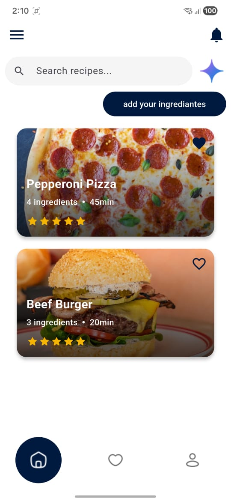

# recipe_app_withai

A new Flutter project.

## Screens Preview

| Screen | Preview |
|-------|---------|
| Splash Screen |  |
| Home Screen |  |
| Meal Details |  |
| Ai Chat |  |
| Profile |  |

## Getting Started

This project is a starting point for a Flutter application.

A few resources to get you started if this is your first Flutter project:

- [Lab: Write your first Flutter app](https://docs.flutter.dev/get-started/codelab)
- [Cookbook: Useful Flutter samples](https://docs.flutter.dev/cookbook)

For help getting started with Flutter development, view the
[online documentation](https://docs.flutter.dev/), which offers tutorials,
samples, guidance on mobile development, and a full API reference.
